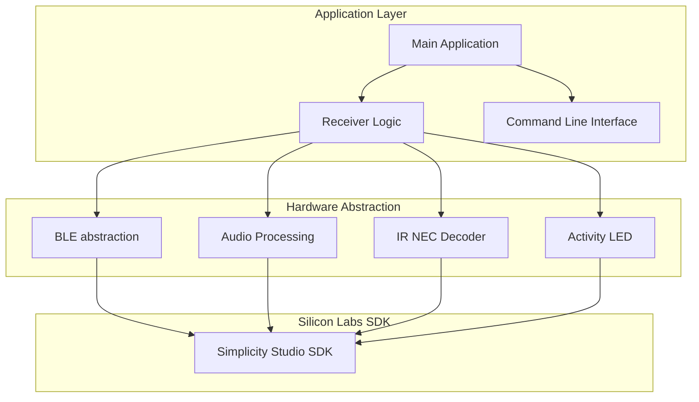
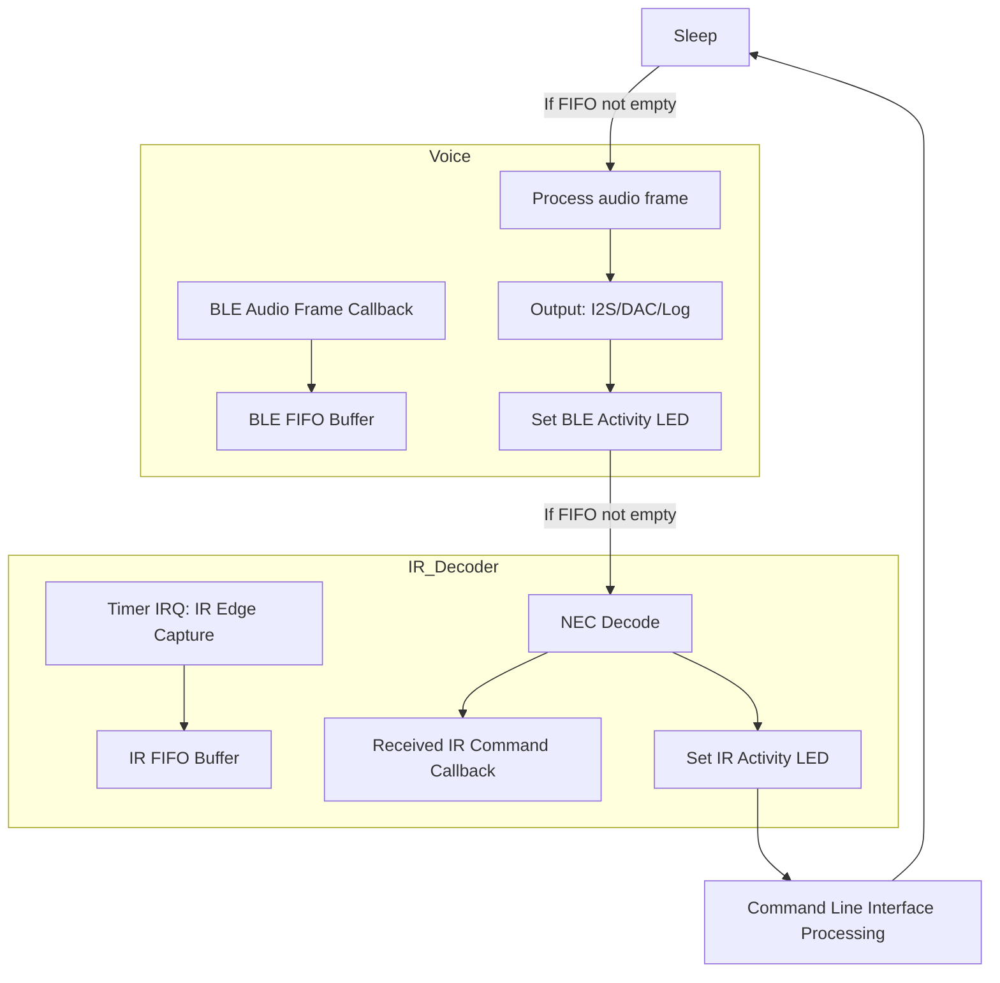
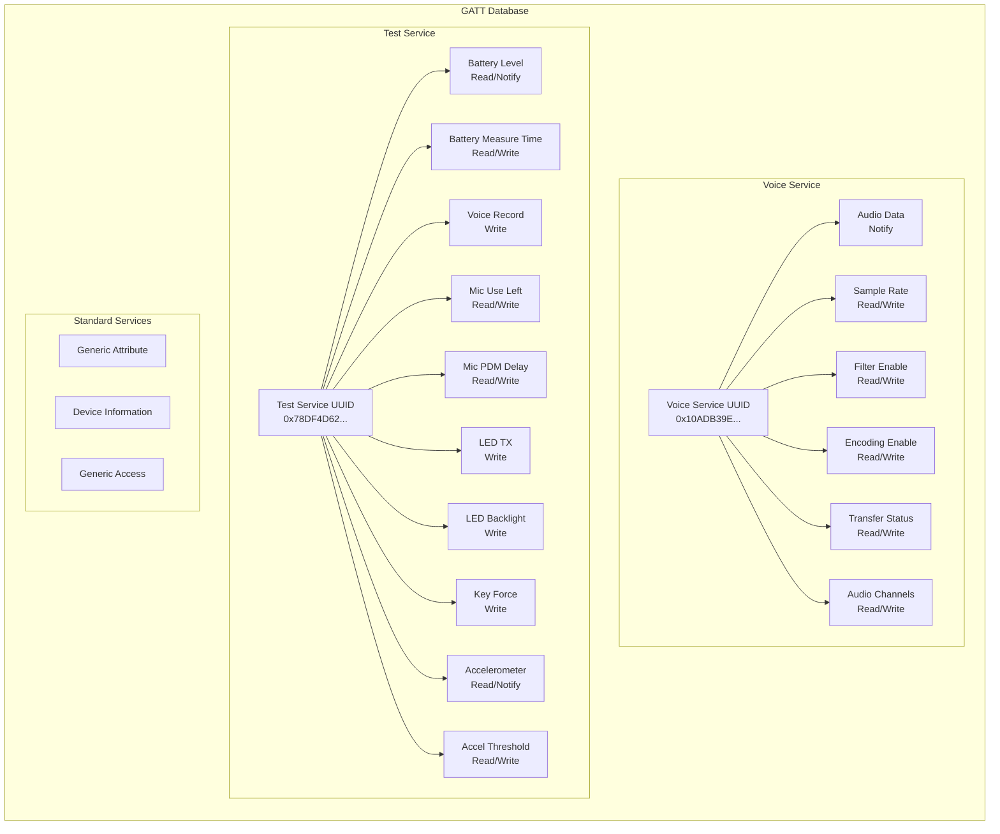

# BLE Remote Test Receiver

## Overview
This project implements a BLE Remote Test Receiver on a Silicon Labs microcontroller. It is designed to receive, process IR remote control signals and voice data over Bluetooth Low Energy (BLE). The receiver supports IR decoding (NEC protocol), voice streaming via I2S and DAC, and provides a command-line interface (CLI) for runtime configuration and diagnostics.

## Debug and release build differences
Currently the debug will assert on any unexpected error, while the release will try to recover from it.

## Hardware Details
- **Target:** BRD4187C - EFR32MG24
- **Key Peripherals Used:**
  - **IR Receiver**
  - **Activity LEDs:**
    - BLE
    - IR
  - **Voice Output:**
    - I2S
    - DAC0
    - CLI

### Pin Configuration of the EFR32MG24
| Function         | Short Name | Port | Pin | Exp. Pin | Notes           |
|------------------|------------|------|-----|----------|-----------------|
| IR NEC Input     | IR_IN      |  A   |  0  | EXP05    | Active low      |
| BLE Activity LED | LED_BLE    |  B   |  4  | N/A      | Active high     |
| IR Activity LED  | LED_IR     |  B   |  2  | N/A      | Active high     |
| I2S SCK          | I2S_SCK    |  A   |  5  | EXP07    | USART0          |
| I2S WS           | I2S_WS     |  A   |  6  | EXP11    | USART0          |
| I2S SD           | I2S_SD     |  A   |  7  | EXP13    | USART0          |
| Analog Audio out | DAC_OUT    |  D   |  2  | EXP09    | VDAC, Channel 0 |

### Example Connections with suggested components (without expansion board)
Ground connection is limited so the additional WSTK header may be required for some connections (or some other mechanism to distribute the GND).

#### IR Decoder ([TSOP3848](https://www.vishay.com/docs/82489/tsop382.pdf))
| Function | TSOP3848 Pin | EFR32MG24 Short Name |
|----------|--------------|----------------------|
| Power    | VCC          | 3V3                  |
| Ground   | GND          | GND                  |
| Output   | OUT          | IR_IN                |

#### I2S Speaker with Amplifier ([MAX98357A](https://www.adafruit.com/product/3006))
This amplifier needs to connected to a speaker, recommended to use a 4-8 Ohm speaker.
| Function         | MAX98357A Pin | EFR32MG24 Short Name |
|------------------|---------------|----------------------|
| Power            | VIN           | 3V3 / 5V             |
| Ground           | GND           | GND                  |
| Left/Right Clock | LRC           | I2S_WS               |
| Bit Clock        | BCLK          | I2S_SCK              |
| Data In          | DIN           | I2S_SD               |

#### Adafruit STEMMA Speaker ([link](https://www.adafruit.com/product/3885))
This speaker has a built-in amplifier and connects to the DAC output.
| Function    | STEMMA Speaker Pin | EFR32MG24 Short Name |
|-------------|--------------------|----------------------|
| Power       | V+                 | 3V3 / 5V             |
| Ground      | GND                | GND                  |
| Audio Input | IN                 | DAC_OUT              |

#### TRRS 3.5mm Jack for PC Recording ([link](https://www.adafruit.com/product/1799))
To record the audio output on a PC, you can connect a TRRS jack to the DAC output.
| Function   | TRRS Jack Pin | EFR32MG24 Short Name |
|------------|---------------|----------------------|
| Left Audio | Tip (Left)    | DAC_OUT              |
| Ground     | Ring 2 (GND)  | GND                  |

## Usage Example
1. **Connect IR receiver and audio hardware as per pinout above.**
2. **Power the board and flash the firmware.**
3. **Connect via BLE to the advertised GATT server.**
4. **Use the CLI (serial/UART) to configure runtime parameters or monitor status.**
5. **Send IR signals or audio; observe BLE notifications and activity LEDs.**

## Features
- **IR Decoding:**
  - NEC protocol
  - Activity LED indication
- **Voice Streaming:**
  - Up to 2 channels, 8 or 16 kHz sample rate
  - Filtering and APCM encoding can be enabled/disabled (on the transmitter)
  - Output via I2S and DAC (both enabled by default)
  - Output to STDOUT for debugging
- **BLE Communication:**
  - Basic BLE central functionality
- **CLI:**
  - Serial command-line interface for runtime configuration, diagnostics, and control

## Configuration
- All major configuration options are in `sl_system_config.h` and `config/` headers.
- **IR:** FIFO depth, input pin, and active state
- **Voice:** Channels, sample rate, encoding, output options (I2S, DAC, log)
- **I2S:** Pinout, data width, mono/stereo, FIFO depth
- **DAC:** Channel, reference voltage, output pin
- **LEDs:** Pinout and active state
- **BLE:** MTU, streaming parameters

## Software Architecture
The BLE Remote Test Receiver firmware is organized into modular components, each responsible for a specific aspect of the system.  
The architecture is designed for clarity, maintainability, and efficient real-time operation on Silicon Labs EFR32MG24 MCUs.

### Main Components
- **Main Application (`main.c`, `app.c`):**
  - Handles system and application initialization.
  - Runs the main event loop.
  - Delegates cyclic processing to the application layer.
- **Application Layer (`app/receiver.c`):**
  - Initializes and coordinates subsystems: IR decoder, voice, activity LEDs.
  - Calls cyclic functions for IR and voice processing.
- **IR Decoder (`drivers/sl_ir_nec_decoder.c`):**
  - Captures and decodes NEC protocol IR signals using hardware timers and FIFO buffering.
  - Signals IR activity to the LED module.
  - Passes decoded commands to the application layer.
- **Voice Module (`app/voice.c`):**
  - Manages audio capture and decoding (ADPCM).
  - Handles BLE streaming of audio data to I2S, DAC, or standard output.
  - Supports runtime configuration via CLI.
- **BLE Stack (`drivers/sl_ble.c`, `autogen/gatt_db.c`):**
  - Implements GATT server for IR and voice data transfer.
  - Handles BLE events, notifications, and connection management.
- **CLI (`cli.c`):**
  - Provides a serial command-line interface for runtime configuration, diagnostics, and control.
  - Exposes commands for voice, BLE, and system settings.
- **Activity LEDs (`drivers/sl_activity_led.c`):**
  - Indicates BLE and IR activity with configurable timeouts.
- **Configuration:**
  - All key parameters are defined in `sl_system_config.h` and `config/` headers.
  - Most settings can be changed at build time or via CLI at runtime.

**Notes:**
- The main loop alternates between system actions, application cyclic processing, and power management.
- IR and voice modules operate independently but can be configured and monitored via CLI.
- BLE notifications are sent for both IR and voice events.
- Activity LEDs provide immediate feedback for IR and BLE operations.

---

### Application Flow

### BLE Service Architecture

## Dependencies
- Silicon Labs Simplicity SDK 2024.12.2
- J-Link RTT (for CLI)
- Commander tool (for flashing)

## References
- [Bluetooth Documentation](https://docs.silabs.com/bluetooth/latest/)
- [UG103.14: Bluetooth LE Fundamentals](https://www.silabs.com/documents/public/user-guides/ug103-14-fundamentals-ble.pdf)
- [QSG169: Bluetooth SDK v3.x Quick Start Guide](https://www.silabs.com/documents/public/quick-start-guides/qsg169-bluetooth-sdk-v3x-quick-start-guide.pdf)
- [UG434: Silicon Labs Bluetooth ® C Application Developer's Guide for SDK v3.x](https://www.silabs.com/documents/public/user-guides/ug434-bluetooth-c-soc-dev-guide-sdk-v3x.pdf)
- [Bluetooth Training](https://www.silabs.com/support/training/bluetooth)
