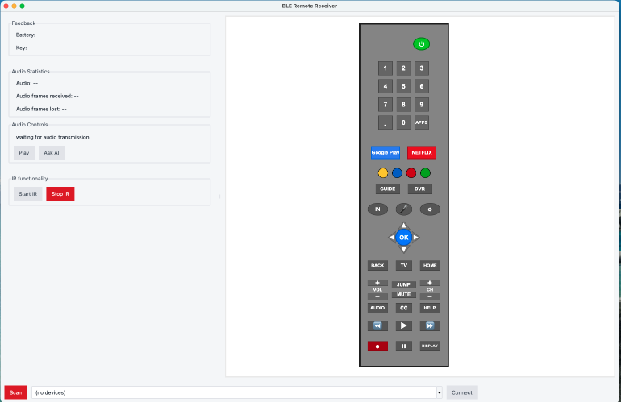
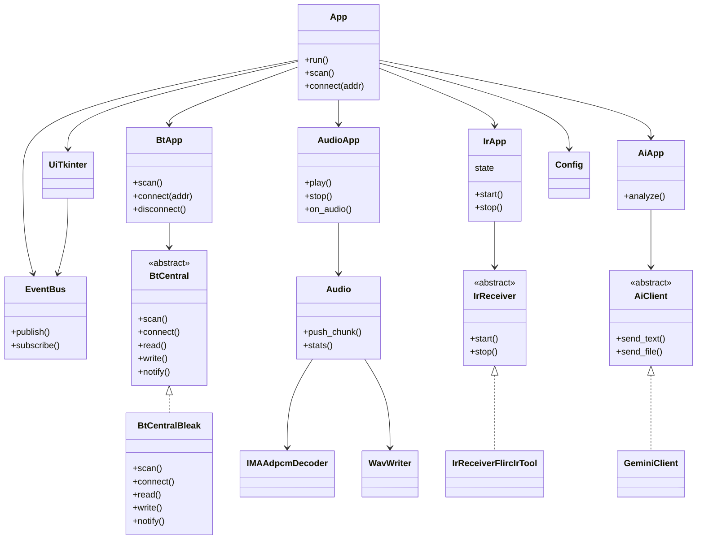
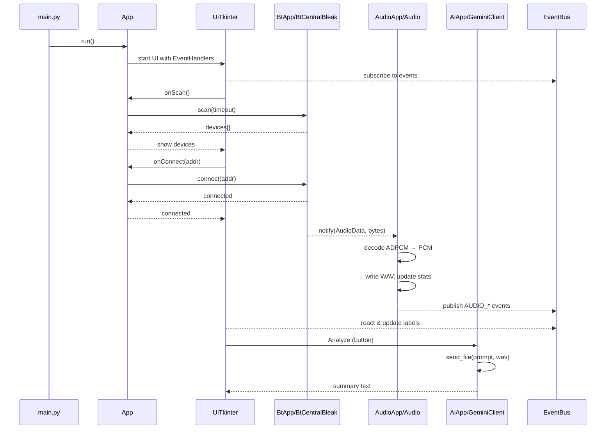
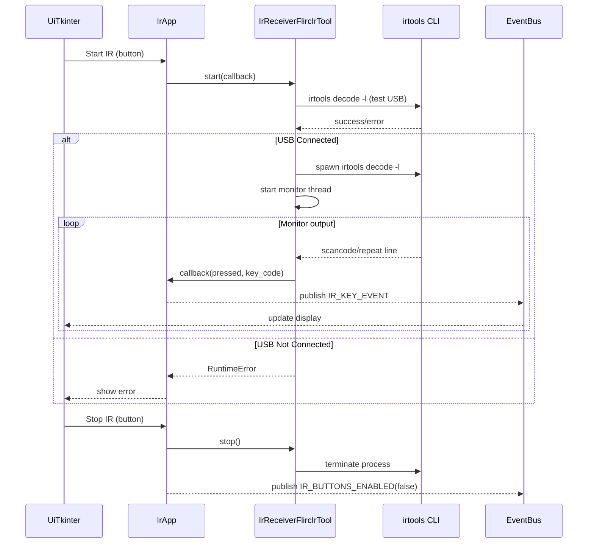
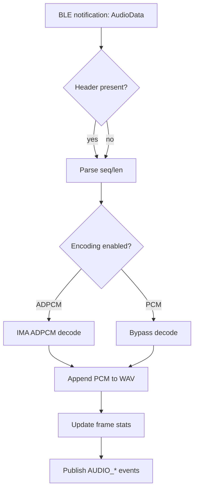

# BLE Receiver on Host tool
> Desktop tool to scan & connect to a BLE remote and acts as a receiver.  


### What it does
- **Scan & connect** to a BLE remote using Bleak.
- **Receive ADPCM audio**, **decode**, and **write WAV** files.
- **Display key presses** and **battery** information from GATT characteristics.
- **IR (optional):** capture scancodes using the vendor `irtools` CLI and display key presses.
- **AI (optional):** send the recorded WAV to a Gemini model for quick analysis.
- **Cross‑platform UI:** Tkinter-based desktop UI.

## Requirements

### Operating Systems
- **Windows 10/11**
- **macOS 15.6+**
- **Linux**: Ubuntu LTS and Raspbian are supported (other distros may work with manual BlueZ setup).

### Python Version
- Python 3.11 or later

### System Dependencies
- **Windows:** Windows BLE APIs (built-in)
- **macOS:** CoreBluetooth (built-in)
- **Linux:** BlueZ stack (must be installed and running)

### Optional Features
- **IR capture:** Flirc software + IR USB receiver
- **AI analysis:** Gemini API key

## Project layout
```
ble-receiver-tool/
├─ ai/                # AI client and integration (Gemini)
├─ audio/             # ADPCM decode, WAV writer, audio controller
├─ bt/                # BLE central abstraction and Bleak-based implementation
├─ ir/                # IR receiver abstraction and `irtools`-based implementation
├─ ui/                # Tkinter UI and event bus
├─ app.py             # Application composition & orchestration
├─ main.py            # Entry point
├─ config.py/json     # Defaults + runtime configuration
─ requirements.txt   # Python dependencies
```

## Setup
### Prerequisites
- Python 3.11+ installed and in PATH
- Verify: `python --version`
- Flirc tool installed from [flirc.tv](https://flirc.tv/)
- Verify: `irtools --version` command line shall work

### Windows

#### Installation Steps
```batch
REM Navigate to project directory
cd tools\receiver_on_host

REM Create virtual environment
python -m venv venv

REM Activate virtual environment
venv\Scripts\activate

REM Upgrade pip and install dependencies
pip install --upgrade pip
pip install -r requirements.txt
```

#### Clean Install (Optional)
If you need to start fresh, remove existing venv:
```batch
rmdir /s /q venv
```

### macOS

**Note:** If using system Python and encountering Tkinter issues, install Python via Homebrew:
  ```bash
  brew install python-tk
  ```

#### Installation Steps
```bash
# Navigate to project directory
cd tools/receiver_on_host

# Create virtual environment
python3 -m venv venv

# Activate virtual environment
source venv/bin/activate

# Upgrade pip and install dependencies
pip install --upgrade pip
pip install -r requirements.txt
```

#### Clean Install (Optional)
If you need to start fresh, remove existing venv:
```bash
rm -rf venv
```

### Linux (Ubuntu/Debian)

#### Installation Steps
```bash
# Navigate to project directory
cd tools/receiver_on_host

python3.11 -m venv venv

# Activate virtual environment
source venv/bin/activate

# Upgrade pip and install dependencies
pip install --upgrade pip
pip install -r requirements.txt
```

#### Clean Install (Optional)
```bash
rm -rf venv
```

## Optional Configuration

### AI Analysis (Gemini)

#### Option 1: Environment Variables
**Windows:**
```batch
set GEMINI_API_KEY=your-api-key-here
set GEMINI_MODEL=gemini-2.5-flash
```

**macOS/Linux:**
```bash
export GEMINI_API_KEY="your-api-key-here"
export GEMINI_MODEL="gemini-2.5-flash"  # Optional, defaults to gemini-2.5-flash
```

#### Option 2: Configuration File
Edit `config.json`:
```json
{
  "ai_api_key": "your-api-key-here",
  "ai_model_name": "gemini-2.5-flash"
}
```
### App Usage

**Windows:**
```batch
cd tools\receiver_on_host
venv\Scripts\activate
python main.py
```

**macOS:**
```bash
cd tools/receiver_on_host
source venv/bin/activate
python main.py
```

**Linux:**
```bash
cd tools/receiver_on_host
source venv/bin/activate
python main.py
# BLE sometimes requires elevated privileges on Linux then run with this:
sudo -E env PATH=$PATH python main.py
```
### Application Workflow
1. **Scan** for BLE devices
2. **Connect** to your remote
3. **Record** audio with the remote
4. **Play** the recorded WAV file
5. **(Optional)** Click **Analyze** to send audio to Gemini AI


## Configuration
Runtime configuration lives in **`config.json`** at the repo root.

| Key               | Example                  | Notes                                                            |
| ----------------- | ------------------------ | ---------------------------------------------------------------- |
| `logging_level`   | `INFO`                   | DEBUG/INFO/WARNING/ERROR                                         |
| `scan_timeout`    | `6.0`                    | Seconds to scan for BLE peripherals                              |
| `remote_adv_name` | `BLE Remote Transmitter` | Expected advertised name of the target peripheral                |
| `ai_api_key`      | ``                       | Optional. If empty, can be provided via `GEMINI_API_KEY` env var |
| `ai_model_name`   | `gemini-2.5-flash`       | Optional. Defaults to `gemini-2.5-flash`                         |


## GATT characteristics
These are read/written by the host to configure and receive data from the remote:

| Name                     | UUID                                   |
| ------------------------ | -------------------------------------- |
| `AudioData`              | `00ce7a72-ec08-473d-943e-81ec27fdc5f2` |
| `SampleRate`             | `00ce7a72-ec08-473d-943e-81ec27fdc601` |
| `FilterEnable`           | `00ce7a72-ec08-473d-943e-81ec27fdc602` |
| `EncodingEnable`         | `00ce7a72-ec08-473d-943e-81ec27fdc603` |
| `TransferStatus`         | `00ce7a72-ec08-473d-943e-81ec27fdc604` |
| `AudioChannels`          | `00ce7a72-ec08-473d-943e-81ec27fdc605` |
| `KeyStatus`              | `faf57611-a4ab-463c-bea5-afe486466760` |
| `KeyConfig`              | `438395b9-c5da-43b5-b886-2911de6e9a93` |
| `Battery`                | `5ae3ff03-96e6-4ccf-a8c6-499a7cccfa7b` |
| `BatteryMeasurementTime` | `7e4f9ee9-5f89-4290-a9b4-3f6f28c30fab` |
| `VoiceRecord`            | `47c24ddf-e65d-4406-942b-186111e46c35` |
| `UseLeftMic`             | `4da595b4-ef2b-452f-87b8-26ec86f6a38a` |
| `MicPdmDelay`            | `cc882a6f-fd2c-4b4b-a2ab-4be46c79db2c` |
| `LedTx`                  | `08e58602-d9e1-425b-be87-5949e753a3a3` |
| `LedBacklight`           | `b10700cf-9f63-4db3-9d22-a767b9ec3831` |
| `ForceKey`               | `a788971a-0ef3-449e-a10b-e58f9f4eae72` |
| `Accelerometer`          | `9a964383-63e8-47bb-a32c-8590d1685ae4` |
| `AccelerometerThreshold` | `e8dc605b-6518-4cf7-a1d0-60f0e54f6e6a` |


## SW architecture
The application is split into **four domain apps**—**BLE**, **Audio**, **IR**, **AI**—coordinated by a thin **App** layer.  
A **UI** layer (Tkinter) binds user actions to domain handlers via a thread‑safe **EventBus**.

### Class diagrams


### Sequence diagrams
**Scan → Connect → Stream audio → Analyze**


**Start IR → Monitor scancodes → Stop**

### Activity diagrams
**Audio packet handling (host side)**

## Building Standalone Executable

### Prerequisites
Ensure PyInstaller is installed (included in requirements.txt):
```bash
pip install pyinstaller
```

### Build Commands

**Windows:**
```batch
pyinstaller -F ^
  --add-data "config.json;." ^
  --add-data "silabsicon.png;." ^
  --name "ble-receiver-tool" ^
  main.py
```

**macOS/Linux:**
```bash
pyinstaller -F \
  --add-data "config.json:." \
  --add-data "silabsicon.png:." \
  --hidden-import tkinter \
  --hidden-import tkinter.ttk \
  --hidden-import tkinter.messagebox \
  --hidden-import tkinter.filedialog \
  --collect-submodules tkinter \
  --name "ble-receiver-tool" \
  main.py
```

### Output
Executable will be in `dist/ble-receiver-tool` (or `dist/ble-receiver-tool.exe` on Windows).

## License
This project have the some license requirements as the main project.
Check [License.md](./../../LICENSE.md) file for the license details.
