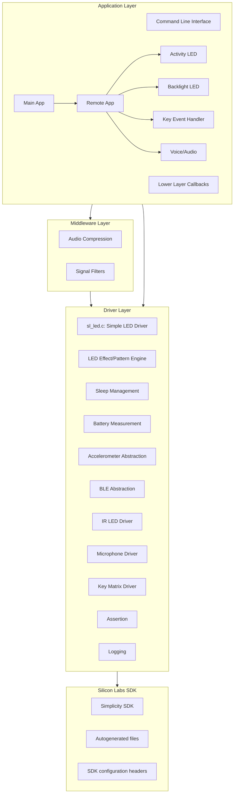

# BLE Remote Transmitter
A Bluetooth Low Energy (BLE) remote control transmitter with IR LED capabilities, designed for smart home automation and entertainment systems.  
This project implements a multi-protocol remote control that communicates via both BLE and infrared signals, with a focus on low-power operation, maintainability, and extensibility.

## Project Overview
The BLE Remote Transmitter is a battery-powered device combining BLE connectivity with traditional IR remote control.  
It features motion detection, voice input and intelligent power management.

### Debug and release build differences
 - **Debug**
    - Asserts on unexpected errors.
    - Provides detailed logging for development and debugging.
    - EM4 disabled.
    - BT timings are optimized for speed.
    - BT advertising will never end.
  - **Release**
    - CLI disabled.
    - Very limited logging, mainly for errors.
    - EM4 enabled and system focuses on low power consumption.
    - BT timings are optimized for power consumption.
    - BT advertising will end after a timeout.

### Key Features
- **Dual Communication**: BLE and IR LED transmission (NEC protocol).
- **Motion Detection**: Accelerometer-based activity sensing (gyroscope might be also used in the future).
- **Voice Input**: PDM microphone with voice processing.
- **Power Management**: Generalized sleep modes, pin latching, and battery monitoring.
- **LED Feedback**: Activity and backlight LEDs.
- **Configurable**: Extensive configuration for all peripherals and power management.
- **Modular Drivers**: Each hardware feature is encapsulated in a dedicated driver (see `drivers/`).

## Hardware Overview
- **Target**: Custom board with EFR32BG22
- **Accelerometer**: Supports ICM-20648 (SPI) and LIS2DE12/LIS2DW12 (I2C)
- **Gyroscope**: LSM6DSMTR (I2C) for future use
- **Microphone**: Stereo PDM microphone (e.g., INMP441)
- **IR LED**: 38 kHz PWM, NEC protocol
- **Activity/Backlight LEDs**: PWM, effect possibility
- **Key matrix**: 6x8 matrix with an extra uniquely handled button
- **Battery**: Voltage monitoring

### Pin Mapping
#### Product Increment 1 - BRD4184A
| Function       | Port | Pin | Description           |
|----------------|------|-----|-----------------------|
| IR LED         | A    | 8   | 38kHz PWM output      |
| Activity LED   | 0    | 5   | Status indicator      |
| Backlight LED  | 1    | 0   | Backlight control     |
| Mic Enable     | A    | 0   | Microphone power      |
| Mic PDM CLK    | C    | 6   | PDM clock             |
| Mic PDM DATA   | C    | 7   | PDM data              |
| Accel MOSI     | C    | 0   | SPI MOSI              |
| Accel MISO     | C    | 1   | SPI MISO              |
| Accel CLK      | C    | 2   | SPI clock             |
| Accel CS       | B    | 2   | SPI chip select       |
| Accel INT      | B    | 3   | Interrupt             |
| Accel EN       | B    | 4   | Power enable          |

The only external connection is the IR LED which shall be connected to the pin mentioned above.
(Anode to the pin, cathode to GND, and a current limiting resistor in series.)

#### Product Increment 2 - BRD9402
Pin mapping is NOT listed here because it is already set in the `sl_system_config.h` file according to the board design (no external connections).

## Workspace Structure
```
common/                     # Common utilities, code and build scripts
transmitter_app/            # This project
├── app/                    # Application logic (state machines, cyclic handlers)
├── autogen/                # SDK auto-generated files (GATT, linker, CLI, etc.)
├── config/                 # SDK system and peripheral configuration headers
├── middleware/             # Reusable middleware components
├── drivers/                # Modular drivers (LED, IR, accelerometer, battery, sleep, etc.)
├── transmitter_app_cmake/  # CMake-based build system
├── main.c, app.c           # Entry points and glue code
│── cli.c                   # Command Line Interface
├── system_config.h         # System configuration
└── readme.md               # This documentation
```

## Configuration
- All system and peripheral settings are in `sl_system_config.h` and in `config/` folder.
- Key configuration options:
  - Pin mappings
  - BLE advertising/connection
  - IR protocol and timing
  - Accelerometer/microphone thresholds
  - Power management (timeouts, pin latching)
  - LED patterns and timeouts

## Software Architecture


### Layer Descriptions
- **Application Layer:** Implements product-specific logic, state machines, and event handling.
- **Middleware:** Provides reusable logic for the application layer.
- **Drivers:** Project specific hardware abstraction (driver only does what the project really needs).
- **Platform & SDK:** Silicon Labs Simplicity SDK, third-party libraries (e.g. mbedTLS, SEGGER RTT, printf), SDK configuration and autogenerated files.

---

## Resources
- [Bluetooth Documentation](https://docs.silabs.com/bluetooth/latest/)
- [UG103.14: Bluetooth LE Fundamentals](https://www.silabs.com/documents/public/user-guides/ug103-14-fundamentals-ble.pdf)
- [QSG169: Bluetooth SDK v3.x Quick Start Guide](https://www.silabs.com/documents/public/quick-start-guides/qsg169-bluetooth-sdk-v3x-quick-start-guide.pdf)
- [UG434: Silicon Labs Bluetooth ® C Application Developer's Guide for SDK v3.x](https://www.silabs.com/documents/public/user-guides/ug434-bluetooth-c-soc-dev-guide-sdk-v3x.pdf)
- [Bluetooth Training](https://www.silabs.com/support/training/bluetooth)
